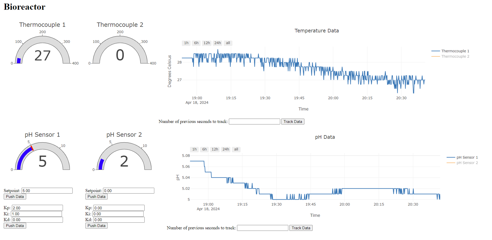
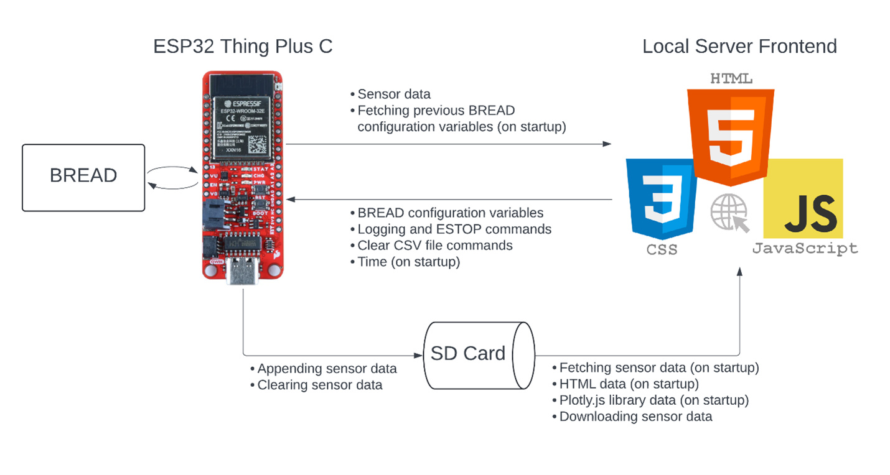

# Summary

New software, aptly named Butter, for the Broadly Reconfigurable and Expandable Automation Device (BREAD) [@Oberloier2023-ko] system  allows users to control BREAD wirelessly from any device without a Wi-Fi network in place. The user first connects to the local network running on an ESP32 microcontroller and then enters an IP address in their web browser to view the user interface (UI) as a webpage. By entering setpoints and controller tuning parameters, they can monitor and operate the sensors and actuators attached to their BREAD system. Butter features include:

- Real-time data tracking with scrollable and resizable graphs (e.g. temperature).
- Colour-changing gauges to quickly show real-time data and indicate values below or above desired setpoints (e.g. overheating).
- Ability to separate BREAD controls into separate sections (e.g. pyrolysis or bioreactor).
- Inputs for variables (e.g., temperature and motor speed) along with proportional (Kp),  integral (Ki) and derivative (Kd) components for the PID controllers.
- Data logged to SD card in comma separated value (CSV) files.
- Ability to download/clear data directly from webpage.
- Connection indicator to show if user is connected to ESP32.
- Emergency stop button that immediately sets all actuators to safe state.

Note that the software was created for a specific setup consisting of a pyrolysis reactor, bioreactor, and chemical deconstruction reactor; however, alternative setups can be created by copying software elements like the gauges and graphs and modifying their labels. The system was only tested on a SparkFun Thing Plus - ESP32 WROOM; however, other ESP32 development boards may also be compatible.

# Statement of need

Although open-source data acquisition (DAQ) systems exist for specific applications [@Pringle2020-ek], more generalized systems [@Herbst2014-xo; @Ferrero_Martin2014-kz; @Niehaus2023-au], and the systems in references 13-29, the majority of science is still reliant on expensive and proprietary systems. Complex systems, also involving supervisory control, can cost tens of thousands of dollars and are made inaccessible to the vast majority of the world’s scientists [@Maia_Chagas2018-us]. The functions of simple supervisory control and data acquisition (SCADA) systems can be handled by existing open-source alternatives; however, as desired function count increases, the complexity of integrating the designs increases substantially. BREAD solves these challenges with open-source, plug-and-play hardware and can be used for complex systems[@Hafting2023-zf]. BREAD still lacks the software capabilities, however, to make the control and visualization of the system accessible to most labs. Additionally, the current layout of the BREAD framework requires users to implement their own controller to host a user interface, send commands to cards (Slices), and gather and log data.

A new wireless software is also needed to overcome the limitations of a wired I2C connection. Previous BREAD systems were controlled with a Raspberry Pi running MOST OpenReactor software [@MOST_OpenReactor], which had to be physically connected to the back plain (Loaf). Due to the distance limitations of I2C (~1m) and purchasing multiple peripherals to wire multiple BREAD systems together was impractical. 

# Implementation

The hardware and software of Butter consists of a SparkFun Thing Plus - ESP32 WROOM programmed in C++. A 32GB SD card inserted into the ESP32 stores a file called `index.html` that contains the HTML and JavaScript code for a locally hosted webpage. The `Plotly.js` library [@plotlyjs] is also stored on the SD card to display graphs and gauges as part of the UI \autoref{fig:bioreactor-webpage}. Using the Arduino `WiFi` library [@arduino-esp32] and `ESPAsyncWebServer` library [@ESPAsyncWebServer] the ESP32 hosts a webpage on its own Wi-Fi network. The webpage acts as the frontend, the ESP32 as the backend/server side, and the SD card as a database for storing sensor data in CSV files. HTTP POST and GET requests facilitate communication of commands and variables between the frontend and backend \autoref{fig:flowchart}. 

When connecting to the webpage a series of requests are executed. First the user’s device sends a GET request to retrieve and load the HTML data within `index.html` and the `Plotly.js` library located on the SD card. On the server side, data from the CSV files on the SD card are fetched and plotted on the graphs. A POST request is subsequently sent to the ESP32 to fetch the BREAD configuration variables such as setpoints, if they were previously entered, and all webpage button states. Inside the body of the POST request is the current time of the device that is connected to the server. The ESP32 receives the POST request, reads the time in the POST request body, sets the internal Real Time Clock (RTC), and sends the BREAD configuration variables to the server. The server fills out the configuration variables in the input sections and configures the correct button states. The ESP32 updates sensor data on the server with an event source under the URL `/events`. This allows the ESP32 to asynchronously send sensor data to the webpage without needing to send a POST request. The webpage then reads these values with event listeners.

# How to Install and Use

1.  Load files from `Website Code on SD Card` folder onto SD card and insert the card into the ESP32.
2.  Upload code in the `.ino` file in `Arduino Code` folder to the ESP32.
3.	Connect to newly created Wi-Fi access point `BREAD-DARPA` with the password `12345678`.
4.	Open Arduino IDE serial monitor and copy IP address.
5.	Paste IP address into any web browser.

# Future Changes

A number of future changes can be made to improve the overall performance and adaptability of Butter. Firstly, implement JSON objects instead of character delimiters to transmit data and better organize the communication between the ESP32 and webpage. Secondly, add successful transmission indicators beside each button to verify that POST requests from the webpage to the ESP32 were received. This can help users debug problems with POST request transmissions. Thirdly, store BREAD configuration variables on the SD card to save them in the event of a power outage, or revert all states back to a safe configuration. Currently, if the if the ESP32 loses power, all the BREAD configuration variables are lost, and the user will have to re-enter them again on the webpage. Lastly, adding  CSS styling can improve the appeal to a broader audience. 

# Figures

# References